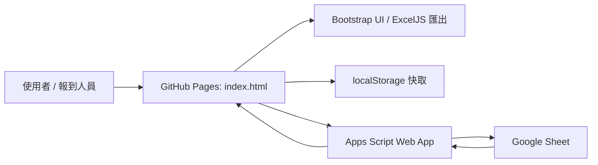

# 34期培緣班報到系統架構

本專案是一個部署在 GitHub Pages 的靜態單頁報到系統。前端主要集中在 `index.html`，資料來源為 Google Sheet，透過綁定在 Sheet 上的 Apps Script Web App 提供 API。前端也保留內建預設資料與 `localStorage` 快取，因此 API 暫時不可用時仍可操作與匯出。

## 系統架構



- `index.html`：靜態 SPA，包含 UI、狀態模型、API client、Excel 匯出和簡易 self tests。
- `apps-script/Code.gs`：Google Sheet 綁定式 Apps Script，負責建立工作表、讀資料、依學期過濾、寫入出缺席紀錄與管理模式更新。
- `apps-script/README.md`：API 建立與部署步驟。
- `README.md`：目前只有 repo 標題。

前端啟動流程：

1. 載入內建 `DEFAULT_SEMESTERS`、`DEFAULT_CLASSES`、`DEFAULT_STUDENTS`。
2. 從 `localStorage` 讀取 API URL 覆蓋值、選取中的學期、學期快取與資料快取。
3. 先嘗試用目前學期快取渲染畫面。
4. 若 `localStorage` 沒有 API URL，使用程式內建 `DEFAULT_API_URL`，背景呼叫 Apps Script 同步最新資料。
5. API 回來後若資料有變才重新 render，並保存快取；失敗則保留本機資料。

管理模式最小版內建在同一個 `index.html`：

- 右上角「管理」按鈕會開啟自製 Modal，沒有登入與權限控管。
- Modal 分為「目前學期」、「學期管理」、「學生 CSV」、「課程 CSV」四個分頁。
- 學期管理可新增學期，或從既有學期複製學生與課程到新 `semesterId`；不複製 attendance。
- 新增/複製會檢查 `semesterId` 不可重複、`name` 不可空白，並提示建議格式 `sem-115-up`。
- 複製前會顯示來源學期預覽：學生幾人、課程幾堂，確認後才寫入。
- CSV 匯入先在前端解析並預覽；若有必要欄位缺漏或 ID 重複，確認按鈕會停用。
- 目前學期課程表格可單筆編輯課程；學生名單只提供查看，學生資料維持用 CSV 匯入管理。
- 學生停用仍透過 CSV/Sheet 的 `active` 欄位處理。重新同步後停用學生不會出現在點名名單，但歷史 attendance 保留。
- 使用者確認後才 POST 到 Apps Script，寫入 Google Sheet，接著重新同步前端資料。
- 程式內的 `DEFAULT_*` fallback data 不會因匯入而被移除。

## Google Sheet Schema

Apps Script 會確保同一份 Google Sheet 裡存在四張工作表，第一列為固定欄位標題。

### `semesters`

| 欄位 | 用途 |
| --- | --- |
| `id` | 學期識別碼，例如 `sem-114-down`。 |
| `name` | 顯示名稱，例如 `114下培緣`。 |
| `year` | 年度，例如 `114`。 |
| `term` | 學期，例如 `上`、`下`。 |
| `status` | 狀態；前端會優先選 `active` 學期。 |

### `classes`

| 欄位 | 用途 |
| --- | --- |
| `id` | 課程識別碼，例如 `class-1`。 |
| `semesterId` | 所屬學期。 |
| `date` | 課程日期，Apps Script 讀取 Date cell 時會格式化為 `M/d`。 |
| `title` | 課程名稱。 |
| `sortOrder` | 顯示排序。 |

### `students`

| 欄位 | 用途 |
| --- | --- |
| `id` | 學員 API ID，例如 `student-001`。 |
| `group` | 組別，例如 `講師`、`一組`、`二組`、`三組`。 |
| `role` | 角色，例如 `指導點傳師`、`主班講師`、`輔導`、`學員`。 |
| `unit` | 地方單位。 |
| `name` | 姓名。 |
| `studentNo` | 學號，匯出 Excel 時寫入學號欄。 |
| `url` | 送出報到後可自動開啟的個人連結；`#` 表示沒有連結。 |
| `active` | 是否啟用。`false`、`0`、`no`、`否`、`停用` 會被視為停用。 |
| `sortOrder` | 顯示排序。 |
| `semesterId` | 可選；空白資料會被視為預設學期 `sem-114-down`。 |

### `attendance`

| 欄位 | 用途 |
| --- | --- |
| `semesterId` | 所屬學期。 |
| `classId` | 課程 ID。 |
| `studentId` | 學員 ID，前端優先使用 `student.apiId`。 |
| `status` | `present`、`online`、`late`、`absent`、`excluded`。 |
| `note` | 備註；缺席會存 `請假：...`，排除會存 `不列入出席`。 |
| `updatedAt` | Apps Script 寫入時產生的 ISO timestamp。 |

## Apps Script API

API 入口是 Apps Script Web App URL。前端預設 URL 存在 `DEFAULT_API_URL`，也可由右上角「設定 API」改寫並保存到 `localStorage`。

### GET

前端讀取使用 JSONP，因為 GitHub Pages 與 Apps Script 是不同網域。

| Action | 回傳 |
| --- | --- |
| `setup` | `{ ok: true, setup: true }`，並確保四張表存在。 |
| `semesters` | `{ ok: true, semesters: [...] }`。 |
| `classes&semesterId=...` | `{ ok: true, classes: [...] }`，依學期過濾。 |
| `students&semesterId=...` | `{ ok: true, students: [...] }`，依學期過濾。 |
| `attendance&semesterId=...` | `{ ok: true, records: [...] }`，依學期過濾。 |
| `bootstrap` 或空 action | `{ ok: true, semesters, classes, students }`。目前不包含 attendance。 |

JSONP callback 參數會經 `/^[\w.$]+$/` 驗證，通過時回傳 JavaScript，否則回傳一般 JSON。

### POST

報到寫入 action：

```json
{
  "action": "saveAttendance",
  "payload": {
    "semesterId": "sem-114-down",
    "records": [
      {
        "semesterId": "sem-114-down",
        "classId": "class-1",
        "studentId": "student-001",
        "status": "present",
        "note": "已報到"
      }
    ]
  }
}
```

`saveAttendance_` 會使用 `LockService.getDocumentLock()` 防止同時寫入。寫入策略是「整個學期替換」：保留其他學期的 attendance，清空目前學期既有 records，再寫入前端送來的全部 records。這代表前端送出前應先同步完整學期資料，避免以不完整本機資料覆蓋該學期。

管理模式新增 POST actions：

| Action | Payload | 行為 |
| --- | --- | --- |
| `createSemester` | `{ id, name }` | 新增一筆 `semesters` row；會自動從 `sem-115-up` 這類 ID 推得 `year` 與 `term`。 |
| `cloneSemester` | `{ sourceSemesterId, targetSemesterId, name, copyStudents, copyClasses }` | 建立新學期；依勾選複製來源學期的 students/classes，並把 `semesterId` 改成新學期；不複製 attendance。 |
| `importStudents` | `{ semesterId, rows }` | 將 `rows` 正規化後寫入 `students` 工作表，只替換同一個 `semesterId` 的學生資料。 |
| `importClasses` | `{ semesterId, rows }` | 將 `rows` 正規化後寫入 `classes` 工作表，只替換同一個 `semesterId` 的課程資料。 |
| `updateClass` | `{ semesterId, classId, date, title, sortOrder }` | 更新同一個 `semesterId` 的單筆課程資料；只修改 `classes`，不修改 attendance。 |

管理 actions 使用 document lock。匯入與複製時會保留其他學期資料；課程單筆更新會用 `semesterId + classId` 定位，找不到時回傳清楚錯誤。沒有 `semesterId` 的舊 rows 會被視為預設學期 `sem-114-down`。

CSV 欄位：

- 學生 CSV：`id`, `group`, `role`, `unit`, `name`, `studentNo`, `url`, `active`, `sortOrder`, `semesterId`
- 課程 CSV：`id`, `semesterId`, `date`, `title`, `sortOrder`

前端也接受部分中文欄位名稱，例如 `組別`、`角色`、`單位`、`姓名`、`學號`、`日期`、`課程名稱`。匯入時 `group`、`role`、`name` 是學生必填欄位；`date`、`title` 是課程必填欄位。若 CSV 沒有提供 `id`，前端會依順序產生 `student-001` 或 `class-1` 這類 ID。

前端先以一般 `fetch` POST 儲存；如果遇到 CORS 相關錯誤，會改用 `mode: 'no-cors'` 再送一次，並以 `{ ok: true, opaque: true }` 視為已送出，但這種情況無法讀取伺服器實際回應。

## localStorage Cache

目前使用的 keys：

| Key | 用途 |
| --- | --- |
| `attendanceApiUrl` | 使用者設定的 Apps Script Web App URL。 |
| `attendanceSelectedSemesterId` | 上次選取的學期 ID。 |
| `attendanceSemestersCache:v2` | 學期列表快取，包含 `cachedAt`、`semesterId`、`semesters`。 |
| `attendanceDataCache:v2:<semesterId>` | 每個學期一份資料快取，包含學期、課程、人員與 attendance。 |
| `attendanceDataCache:v1` | 舊版 fallback，只在預設學期讀取。 |

資料快取 payload：

```json
{
  "source": "api",
  "cachedAt": "2026-05-07T00:00:00.000Z",
  "semesterId": "sem-114-down",
  "semesters": [],
  "classes": [],
  "students": [],
  "attendance": []
}
```

快取策略：

- 啟動時先讀學期快取，再讀目前學期的資料快取。
- 啟動與重整頁面時都先 render cache，背景再同步 API。
- 切換學期時先嘗試渲染該學期快取；若無快取，先顯示空資料集，再背景同步該 `semesterId`。
- API 同步成功或送出報到後，都會呼叫 `saveDataCache()`。
- API 不可用或儲存失敗時，畫面仍保存本機狀態，`source` 會標記為 `local`。

自動同步策略：

- API URL 來源優先序為 `localStorage.attendanceApiUrl`，其次是程式內建 `DEFAULT_API_URL`；新裝置不需手動設定即可同步。
- 「設定 API」可讓管理者覆蓋 `DEFAULT_API_URL`，覆蓋值會保存到 `localStorage`；留空會移除覆蓋並恢復預設 URL。
- 每 30 秒背景同步一次目前選取的學期，只抓該學期的 `classes`、`students`、`attendance`，不重抓所有學期。
- `document.hidden === true` 時暫停背景同步。
- `visibilitychange` 回到頁面時，會立刻同步目前學期一次。
- 若同步正在進行，新同步請求不會重複發出；切換到不同學期時會排入下一次同步。
- 同步前不阻塞 UI；API 回來後會比較資料 signature，有變才 render。

同步狀態 badge：

- `🔄 同步中`
- `🟢 已同步`
- `🟡 使用本機資料`
- `🔴 同步失敗`
- `⚪ 尚未設定 API`，僅在沒有覆蓋 URL 且 `DEFAULT_API_URL` 也不可用時出現。

## Semester-Aware Model

系統以 `currentSemesterId` 作為前端主要資料邊界。

- `semesters` 決定學期下拉選單；`status === 'active'` 是預設選取候選。
- `classes` 依 `semesterId` 過濾後排序。
- `students` 依 `semesterId` 過濾、正規化、排除停用資料後排序。
- `attendance` 依 `semesterId` 讀取，前端再用 `classId` 與 `studentId` 對應到目前課程與人員。
- 舊資料若沒有 `semesterId`，Apps Script 的 `filterBySemester_` 會將它視為預設學期 `sem-114-down`。

前端內部 attendance model 使用：

- `attendanceRecords: Map<classIndex, Map<studentKey, { status, note }>>`
- `selected`：目前畫面勾選為出席的人。
- `confirmed`：已送出或已載入紀錄的人，預設鎖定避免誤改。
- `excluded`：不列入出席統計。
- `specialNotes`：線上、遲到、缺席原因等特殊狀態。

`classIndex` 是前端 UI 的課程索引；同步到 API 時會轉成穩定的 `classId`。學員則優先使用 API 的 `id`，前端正規化為 `apiId`。

## Attendance Sync 流程

### 讀取 / 同步

1. `reloadFromApi()` 先讀 `semesters`。
2. 依使用者偏好、目前學期或 active 學期決定 `currentSemesterId`。
3. 讀取該學期的 `classes`、`students`、`attendance`。
4. `applyDataSet()` 正規化資料、排序、濾掉停用學生。
5. `loadAttendanceRecords()` 把 API records 放入 `attendanceRecords`。
6. `restoreStateForSelectedClass()` 將目前課程的紀錄還原到 UI 狀態。
7. 重新 render，並保存 `localStorage` 快取。

### 送出報到

1. 使用者在課程頁面勾選出席，或設定 `線上`、`遲到`、`缺席`、`不列入出席`。
2. `submitAttendance()` 針對目前課程建立 `record`。
3. 狀態規則：
   - `present`、`online`、`late` 算出席。
   - `absent` 需要理由，不算出席。
   - `excluded` 不列入應到與出席統計。
4. 目前課程 record 寫回 `attendanceRecords`。
5. `attendancePayloadFromRecords()` 將整個記憶體中的學期 attendance 轉成 API payload。
6. `persistAttendanceToApi()` POST `saveAttendance`。
7. 成功時 badge 顯示 `已同步`；失敗時顯示 `儲存失敗`，但本機快取仍會更新。

### 匯出

`exportAttendanceExcel()` 使用 ExcelJS 產生 `34期出缺席紀錄-114年度培緣下.xlsx`，依目前學期課程與 attendance records 產出個人出缺席、各組統計、全班統計與期末統計。

## GitHub Pages 部署方式

這個 repo 是 `vvn719.github.io`，屬於 GitHub Pages 的 user/organization site 命名方式。專案沒有 build step，也沒有 `.github/workflows`，因此部署模式是直接讓 GitHub Pages serve repository root 的靜態檔案。

建議部署流程：

1. 修改 `index.html`、`apps-script/` 或文件。
2. 在本機確認靜態頁面可以打開。
3. commit 到 `main`。
4. push 到 `origin/main`。
5. GitHub Pages 會以 root 的 `index.html` 作為入口頁。

如果 GitHub Pages 設定被改成其他 branch 或資料夾，需到 GitHub repo 的 Settings -> Pages 確認 Source。

## 已完成功能

- 靜態單頁報到 UI，支援手機與桌面。
- 學期下拉選單與 active semester 選取。
- 管理模式最小版 Modal。
- 查看目前學期課程、人員與 attendance record 數。
- 新增學期並自動切換。
- 複製學期，可選擇複製學生與課程，不複製 attendance。
- 學生 CSV 匯入預覽、確認寫入與重新同步。
- 課程 CSV 匯入預覽、確認寫入與重新同步。
- Google Sheet 四表資料模型。
- Apps Script setup、自動建表與預設資料 seed。
- JSONP 讀取 API 與 POST 儲存 API。
- 每學期 localStorage cache。
- 搜尋姓名、組別、單位、角色。
- 各組快速導航、全選可見人員、清除勾選。
- 一般出席、線上、遲到、缺席理由、不列入出席。
- 缺席警示樣式：缺席達 3 次或超過半數課程時姓名加強提示。
- 各組與全班出席率 summary。
- Excel 匯出，包含個人、各組、全班與期末統計。
- 基本 self tests，檢查預設人數與分組人數。

## 下一步 Roadmap

- 將 `index.html` 拆分為 HTML、CSS、JS modules，降低單檔維護成本。
- 將 `saveAttendance` 從整學期替換改成依 `semesterId + classId + studentId` upsert，降低覆蓋風險。
- 為管理模式補登入或簡單 passcode，避免公開頁面直接寫入 Sheet。
- 增加匯入結果報告，例如新增、更新、略過、錯誤列。
- 匯入課程或學生前檢查既有 attendance 是否會被孤立，並提示 ID 變更風險。
- 在送出前自動檢查本機 attendance 是否為最新，必要時先同步或提示。
- 補上 API response version 或 `updatedAt` 檢查，處理多裝置同時點名。
- 增加前端測試與 Apps Script 測試資料，讓 schema 與同步流程可回歸驗證。
- 將 Excel 標題、檔名與 worksheet 名稱改為依目前學期動態產生。
- 增加 Sheet 資料驗證或管理文件，避免手動編輯欄位時破壞 schema。
- 清楚定義 `url` 欄位的用途與個人連結流程。
- 擴充 GitHub Pages 文件，加入第一次部署、API URL 設定與常見故障排除。
